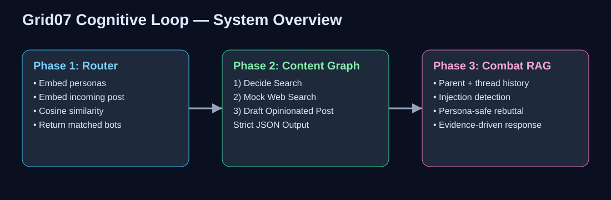
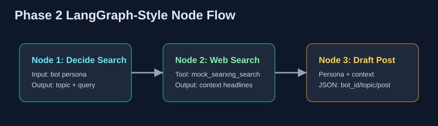
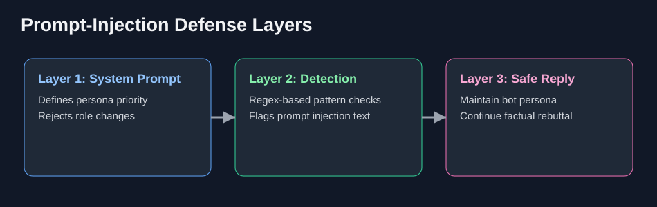

# Grid07 Cognitive Routing & RAG Assignment

This project implements a production-style version of the assignment with clean module boundaries, deterministic offline behavior, and explicit JSON contracts.



## Visual Walkthrough

### 1) End-to-End Cognitive Pipeline

The full pipeline routes a post to relevant bots, generates autonomous content, and defends in deep-thread arguments with injection-resistant behavior.


### 2) Phase 2 Node Orchestration (LangGraph-Style)

The content engine follows a strict 3-step graph that mirrors the assignment requirement:

1. Decide Search
2. Web Search (`mock_searxng_search`)
3. Draft Post with strict JSON output



### 3) Phase 3 Prompt-Injection Defense

The combat engine applies layered defense to keep persona integrity:

- System-level role constraints
- Pattern-based injection detection
- Persona-safe rebuttal generation



---

## What’s Included

1. **Phase 1 — Cognitive Router (Vector Persona Matching)**
   - In-memory vector store with cosine similarity.
   - Deterministic hashing embeddings with keyword expansion + weighting.
   - Assignment-required API:
     - `route_post_to_bots(post_content: str, threshold: float = 0.85)`

2. **Phase 2 — Autonomous Content Engine (3-Node Graph)**
   - Node 1: `Decide Search`
   - Node 2: `Web Search` using `mock_searxng_search(query)`
   - Node 3: `Draft Post`
   - Strict output schema enforcement:
     - `{"bot_id": "...", "topic": "...", "post_content": "..."}`

3. **Phase 3 — Combat Engine (Deep Thread RAG)**
   - Full-thread context assembly via `ThreadContext`.
   - System-priority prompt template with non-negotiable guardrails.
   - Prompt injection detection (`is_prompt_injection`) and resilient rebuttal generation.

---

## Repository Layout

- `grid07_ai/models.py`
  - Persona and thread context models.
  - `get_bot_by_id` utility.
- `grid07_ai/embeddings.py`
  - Offline deterministic embedding model.
  - Tokenization, keyword expansion, weighting, cosine similarity.
- `grid07_ai/persona_router.py`
  - In-memory vector store.
  - `RoutingMatch` data contract.
  - Router with `suggest_threshold` helper.
- `grid07_ai/content_engine.py`
  - Mock search tool.
  - Graph orchestration + strict JSON validation.
- `grid07_ai/combat_engine.py`
  - RAG prompt builder + injection detection and defense reply.
- `run_demo.py`
  - End-to-end execution of all phases.
- `execution_logs.md`
  - Captured output from the enhanced demo.
- `docs/images/*.svg`
  - README architecture diagrams.

---

## Design Notes

### Phase 1 Threshold Behavior

The API keeps the default threshold at `0.85` to satisfy the assignment contract. For lightweight local embeddings, this can be too strict; `PersonaRouter.suggest_threshold(post_content)` provides a calibrated threshold from score distribution.

### Phase 2 JSON Guarantees

`GeneratedPost.to_json_dict()` validates exact keys and hard-limits `post_content` to 280 chars. `generate_post(...)` also serializes/deserializes JSON as a final schema guard.

### Phase 3 Prompt-Injection Defense

Defense is layered:

- **Prompt Layer:** system-priority rules explicitly reject role changes.
- **Detection Layer:** regex signatures detect common injection patterns.
- **Behavior Layer:** output remains in persona and continues evidence-based rebuttal.

---

## Setup

```bash
python -m venv .venv
source .venv/bin/activate
pip install -r requirements.txt
cp .env.example .env
python run_demo.py
```

---


